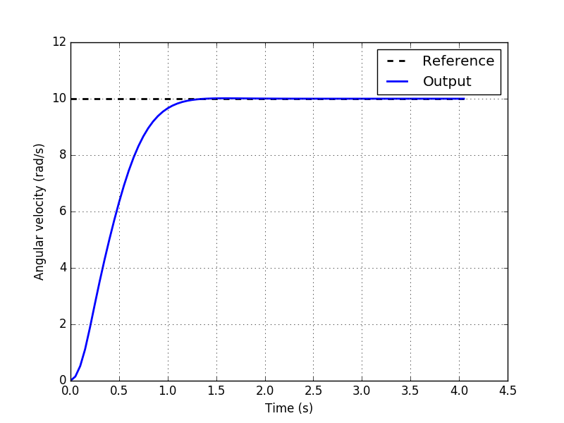

# Predictive Control in Python

This package implements Predictive Control techniques in Python (v2.7). 
Currently it supports only Model-Predictive Control (MPC), although a class for Economic MPC has been added (not tested!).

## Dependencies

* [numpy](https://www.numpy.org/)
* [scipy](https://www.scipy.org/)

## Installation

Install the package directly from PyPI:

```pip install predictivecontrol```

Or clone the repository and install locally:

```pip -e <path_to_repository>```

## Usage

Simply import the class of controller wanted and instantiate it with valid state-space model matrices (A, dA, B and C, D and external disturbances are optional).
Then use the ```run()``` method to update the controller output based on the last sensed or estimated states.

You may also set the prediction and control horizons, the actuation limits and the reference for your control system.

```
from DCMotor import Motor
from predictivecontrol import MPC

dcmotor = Motor()
mpc = MPC(dcmotor.A, dcmotor.dA, dcmotor.B, dcmotor.C)

mpc.set_predict_horizon(10)
mpc.set_control_horizon(4)
mpc.umin, mpc.umax = 0, 100
mpc.dumin, mpc.dumax = -0.5, 0.5

mpc.set_reference(10)

mpc.run()
```

## Examples

This package currently contains 2 [examples](https://github.com/rgmaidana/predictiveControl/tree/master/examples):

* Voltage control in a simulated First-order RC Lowpass filter;
* Motor shaft angular velocity control in a simulated DC Motor;

You can run the examples with:

```python <example>.py```

If you want to plot the results, you must install the matplotlib package:

```pip install matplotlib```

The result you will see is (for DC motor example):



## To-Do

* ~~Test MPC with a different model~~ [DONE]
* Test E-MPC with DC Motor and another model
* Test both controllers with MIMO models
* Account for external disturbances in the controllers

## Credits
Code inspired by [Prof. Dr. Aurelio Salton](https://scholar.google.com/citations?user=uyWSHmAAAAAJ&hl=en)'s MPC matlab example.

## Collaborators

* [Renan Maidana](https://github.com/rgmaidana)
